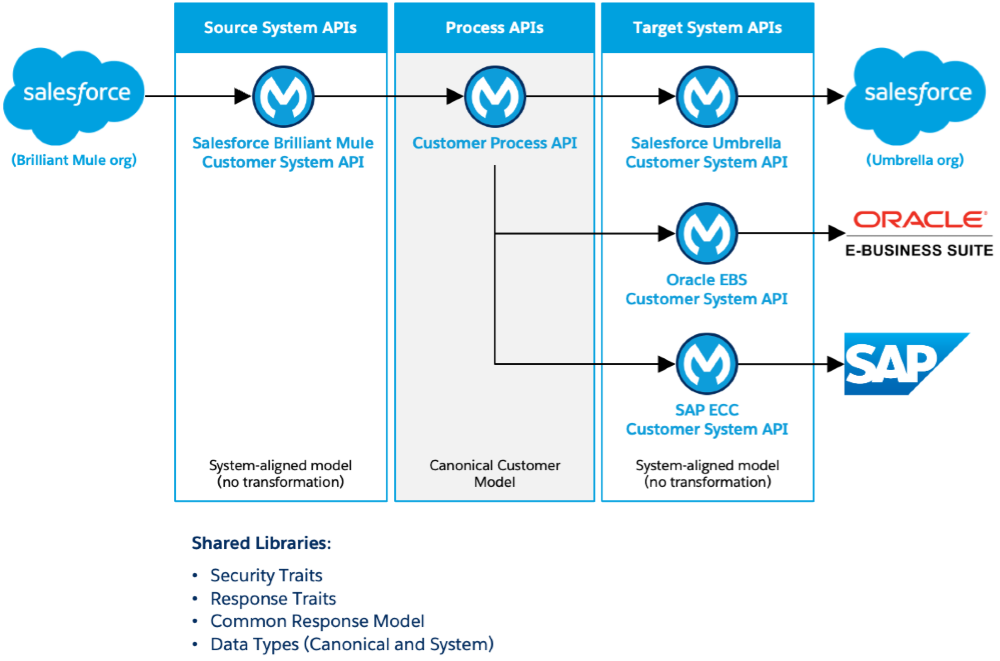

## Overview

This repository provides a Customer API-led Reference Architecture that illustrates the design, structure, and standardization of APIs using an API-led connectivity approach.

It includes:

- System APIs aligned to underlying systems.
- A Process API that orchestrates and transforms data using a canonical model.
- Reusable RAML libraries that standardize data models, response structures, behavior, and security.
- Utility scripts that automate publishing assets to Anypoint Exchange.

This repository functions as both a working implementation and a set of platform standards for reuse across multiple projects.

This reference architecture is based on a demo that illustrates two complementary concepts:

- Event-driven integration using Salesforce Change Data Capture (CDC) in Mule.
- A comprehensive API-led connectivity implementation for customer data across systems.

The assets in this repository reflect the API design and standardization aspects of that demo.

## Architecture Diagram

The diagram below depicts the Customer API-led Reference Architecture, highlighting System APIs, the Process API, and supporting libraries.



The diagram illustrates the interaction between System APIs, the Process API, and the shared libraries that enforce consistency across the architecture.

## Architecture

This implementation follows an API-led connectivity model composed of three layers:

- **System APIs** provide access to underlying systems using system-aligned models.
- **Process APIs** orchestrate data across systems and transform it into a canonical model.
- **Experience APIs** (not included in this repository) consume canonical data and tailor it for specific consumers.

### Key Principles

- **System-aligned data models** -- System APIs reflect the structure and constraints of the underlying system.
- **Canonical data model** -- Defined once and used by Process APIs to enable cross-system consistency.
- **Separation of concerns** -- Each layer has a clearly defined responsibility.
- **Reuse through libraries** -- Common patterns are centralized and reused across APIs.

## Repository Structure

```text
├── apis/
│   ├── customer-papi/
│   ├── oracle-ebs-customer-sapi/
│   ├── sap-ecc-customer-sapi/
│   ├── sf-brilm-customer-sapi/
│   └── sf-umbre-customer-sapi/
│
├── libraries/
│   ├── lib-canonical-customer-types/
│   ├── lib-common-responses/
│   ├── lib-response-traits/
│   └── lib-security-traits/
│
├── scripts/
│   └── upload-exchange-pages.sh
```

Each API and library folder includes the following components:

- `raml/` -- Design-time RAML specifications and fragments.
- `exchange-docs/` -- Documentation pages published to Anypoint Exchange.
- `README.md` -- Overview and usage guidance.

At this stage, the repository focuses on design-time assets, including API specifications and reusable RAML libraries. API implementations (Anypoint Studio projects) will be added in a future update to provide a complete, runnable reference implementation.

## APIs

This repository includes the following APIs:

### Process API

- `customer-papi` -- Orchestrates customer data across systems using the canonical model.

### System APIs

- `oracle-ebs-customer-sapi` -- Provides access to Oracle EBS customer data.
- `sap-ecc-customer-sapi` -- Provides access to SAP ECC customer data.
- `sf-brilm-customer-sapi` -- Provides access to Salesforce (Brilliant Mule) customer data.
- `sf-umbre-customer-sapi` -- Provides access to Salesforce (Umbrella) customer data.

System APIs expose data aligned with the underlying systems and do not transform it into the canonical model.

## Libraries

Reusable RAML libraries are employed to standardize API design throughout the architecture.

### Data Models

- `lib-canonical-customer-types` -- Defines the canonical customer data model used by Process APIs.

### Response and Behavior

- `lib-common-responses` -- Defines the standard response envelope used across APIs.
- `lib-response-traits` -- Defines standardized HTTP response behavior.

### Security

- `lib-security-traits` -- Defines reusable security traits for authentication and authorization.

### Design Model

These libraries work together to provide:

- **Access control** is defined in the Security Traits Library.
- **Response behavior** is defined in the Response Traits Library.
- **Response structure** is defined in the Common Responses Library.
- **Data models** are defined in system-specific and canonical libraries.

## Scripts

The `scripts/` directory contains utility scripts designed to support development workflows.

### upload-exchange-pages.sh

This script automates the upload of documentation pages to Anypoint Exchange for APIs and libraries.

This script:

- Standardizes how documentation pages are published.
- Ensures consistent page structure across assets.
- Reduces manual effort when updating Exchange documentation.

## How It All Fits Together

1. System APIs expose system-specific data using system-aligned models.
2. Process APIs orchestrate across systems and transform data into a canonical model.
3. Libraries enforce consistency across:
   - Data models
   - Response structure
   - Response behavior
   - Security
4. Scripts automate publishing and ensure consistency in Anypoint Exchange.

Together, these components provide:

- A consistent API design standard.
- A reusable set of building blocks.
- A repeatable approach to API development and publication.

## Design-Time Artifacts

All assets within this repository are design-time artifacts utilized to define and publish APIs and libraries to Anypoint Exchange.

These artifacts:

- Define API contracts using RAML 1.0.
- Provide standardized documentation for Exchange.
- Enable consistent reuse across projects.

This repository does not include standardized implementations for logging and error handling. In practice, MuleSoft Professional Services provides reusable patterns for these concerns across engagements. Those assets are not included here, and future implementations may use simplified or custom approaches.

## Intended Audience

This repository is intended for:

- API designers.
- Integration architects.
- MuleSoft developers.
- Platform engineers defining enterprise API standards.

## Versioning

Semantic versioning is applied at the asset level within this repository. Version 1.0.0 represents the initial standardized release of the Customer API-led Reference Architecture.
